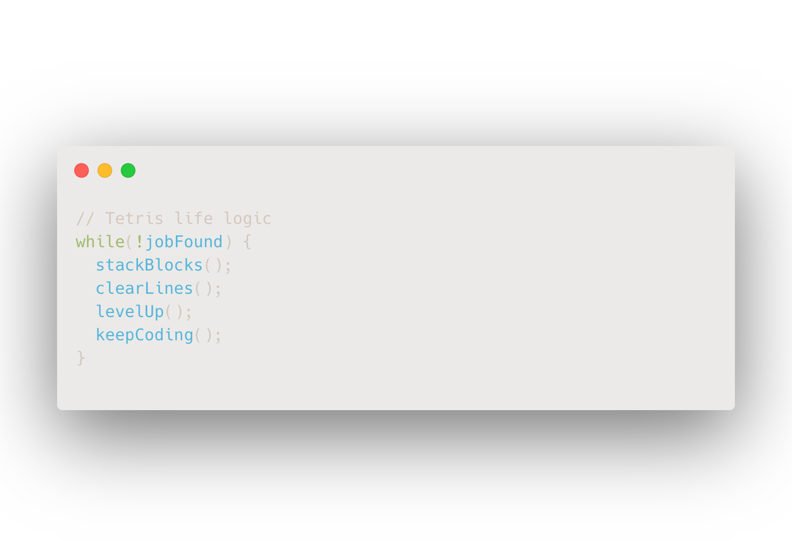

<h1 align="center" style="font-size: 3em; margin-bottom: 0.2em;">
  👋 Hey, I'm Carmen 👩‍💻
</h1>

  

<h2>🏆 GitHub Trophies</h2>

  

<h2>🚀 Skills & Tools</h2>

  🐍 Python | 🐬 MySQL | 📊 Tableau | 🚀 Machine Learning | ☁️ Cloud Computing | 🎯 Data Analysis 
  💻 JavaScript | ⚛️ React | 🌐 Node.js | 🗄️ MongoDB | 🔧 Express.js

<h2>📂 Featured Projects</h2>

<table align="center" width="90%" style="text-align:center; color:#cfd8dc;">
  <thead>
    <tr>
      <th>Project</th>
      <th>Description</th>
      <th>Link</th>
    </tr>
  </thead>
  <tbody>
    <tr>
      <td>Customer Churn Analysis</td>
      <td>Predict customer churn with ML</td>
      <td><a href="https://github.com/ccmens/customer-churn-analysis" style="color:#00d4ff;">Repo</a></td>
    </tr>
    <tr>
      <td>Portfolio Website</td>
      <td>Personal React website</td>
      <td><a href="https://github.com/ccmens/portfolio-website" style="color:#00d4ff;">Repo</a></td>
    </tr>
    <tr>
      <td>ML Job Analyzing</td>
      <td>Analyzing machine learning job postings using Python and databases</td>
      <td><a href="https://github.com/ccmens/ml-job-analyzing" style="color:#00d4ff;">Repo</a></td>
    </tr>
    <tr>
      <td>Capstone Project</td>
      <td>Inventory Management System using React and MongoDB</td>
      <td><a href="https://github.com/ccmens/capstone-inventory" style="color:#00d4ff;">Repo</a></td>
    </tr>
  </tbody>
</table>

<h2>📈 LeetCode Progress</h2>

  

<h2>📫 Contact Me</h2>

  <a href="mailto:carmenshun0629@gmail.com">📧 Email Me</a> &nbsp;&nbsp;|&nbsp;&nbsp;
  <a href="https://www.linkedin.com/in/jiawen-shen-9b7283221/">🔗 LinkedIn</a>

<em>“Keep calm and analyze data. 🚀📊”</em>

